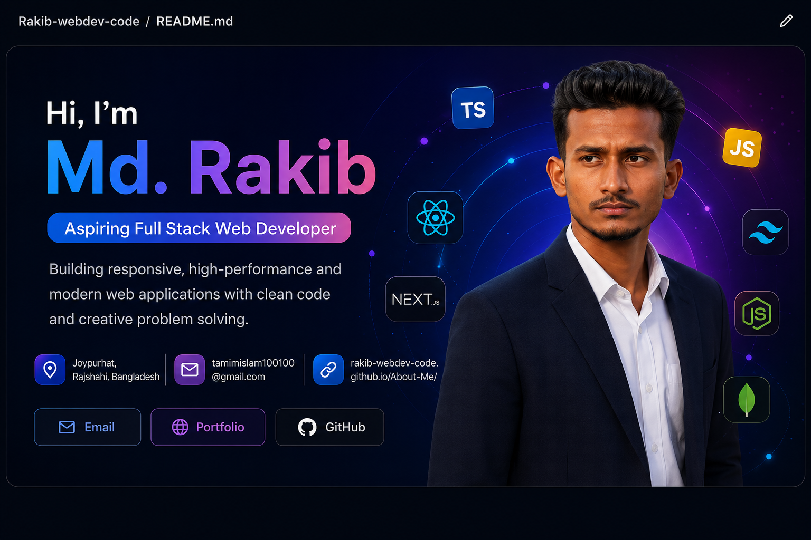

<!-- ===================== BANNER ===================== -->

  

 

<!-- ===================== CURRENTLY WORKING ON ===================== -->

<h2 align="center">🚀 Currently Working On</h2>

  
  
  
  

  🌱 Learning React and building modern user interfaces
   
  💻 Building real-world projects to improve my development skills
   
  📘 Practicing TypeScript and writing cleaner code
   
  🎨 Improving responsive UI with Tailwind CSS
   
  🔧 Strengthening Git & GitHub workflow
   
  🧠 Exploring AI Mindset Engineering and AI-Assisted Coding

 

<!-- ===================== ABOUT ME ===================== -->

<h2>👨‍💻 About Me</h2>

I'm an aspiring Full Stack Web Developer passionate about building
responsive, user-friendly, and modern web applications.

I'm currently learning modern web technologies and improving my
problem-solving skills by practicing and building real-world projects.
My goal is to become a professional Full Stack Developer and
contribute to meaningful projects and open source.

 

<!-- ===================== TECH STACK ===================== -->

<h2>🛠️ Tech Stack</h2>

<h3>Frontend</h3>

  

<h3>Backend & Database</h3>

  

<h3>Tools & Technologies</h3>

  

 

<!-- ===================== GITHUB STATS ===================== -->

<h2>📊 GitHub Stats</h2>

  

  

 

<!-- ===================== GITHUB STREAK ===================== -->

<h2>🔥 GitHub Streak</h2>

  

 

<!-- ===================== CONNECT WITH ME ===================== -->

<h2>🌐 Connect With Me</h2>

  

  

  

 

<!-- ===================== FEATURED PROJECTS ===================== -->

<h2>📌 Featured Projects</h2>

<table>
<tr>

<td width="50%">

<h3>🌍 About Me Portfolio</h3>

A personal portfolio website showcasing my profile,
skills, projects, and learning journey.

<b>Tech:</b> HTML • CSS • JavaScript

<a href="https://rakib-webdev-code.github.io/About-Me/">
🔗 Live Demo
</a>

</td>

<td width="50%">

<h3>🚀 More Projects Coming Soon</h3>

I'm currently learning React, TypeScript and modern
web development technologies while building real-world projects.

<b>Coming:</b> React • TypeScript • Tailwind CSS

</td>

</tr>
</table>

 

<!-- ===================== GOALS ===================== -->

<h2>🎯 My Goals</h2>

🚀 <b>Become a Professional Full Stack Developer</b>

  

💻 <b>Build Real-World Projects</b>

  

🌍 <b>Contribute to Open Source</b>

  

🧠 <b>Master Modern Web Technologies</b>

 

<!-- ===================== LOCATION & CONTACT ===================== -->

<h2>📍 Location & Contact</h2>

🇧🇩 <b>Joypurhat, Rajshahi, Bangladesh</b>

  

📧 <b>tamimislam100100@gmail.com</b>

  

🌐 <a href="https://rakib-webdev-code.github.io/About-Me/">
<b>Portfolio</b>
</a>

 

<!-- ===================== DEVELOPER MINDSET ===================== -->

<h2>💭 Developer Mindset</h2>

  <i>
    "Learn. Build. Improve. Repeat."
  </i>

 

  ⭐ Thanks for visiting my GitHub profile!

